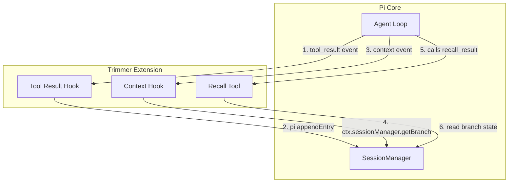

# Specification: Pi Context Trimmer

This specification describes the requirements, architecture, and implementation blueprint for the **Pi Context Trimmer** (implemented as a Pi Extension). This system manages context window bloat, eliminates stale tool results, and enables on-demand agent recall of archived payloads, fully integrated into the Pi TUI/CLI environment.

---

## 1. Executive Summary & Vision

### 1.1 The Problem
When a tool-using agent operates over many turns, bulky tool execution results (such as file reads, grep searches, or database queries) accumulate in the active message context. This causes:
1. **Context Bloat**: Large payloads consume token budgets, increasing latency and cost.
2. **Context Poisoning**: Stale tool results remain in history after the workspace state changes, causing the model to reason over obsolete data.
3. **Semantic Loss**: Coarse truncation or deletion of history removes valuable details without leaving a traceable, recoverable link.

### 1.2 The Solution
This extension introduces a deterministic, event-driven context trimmer that:
- **Reduces Context**: Intercepts large tool results, replaces them with compact **Virtual Pointers** in the active message log, and archives the raw payload.
- **Prevents Poisoning**: Evaluates **Tool Policies** to invalidate older results when newer tool executions target the same resource (e.g. rewriting a file).
- **Enables Recall**: Registers a native tool (`recall_result`) allowing the model to retrieve raw archived content on-demand.
- **Ensures Lineage**: Leverages Pi's tree-structured session format to isolate archives and invalidations to their corresponding history branch.

---

## 2. Glossary

- **Agent Session**: An active running instance of the agent loop, represented as an append-only tree of entries stored in a local `.jsonl` file.
- **Session Manager**: The core component ([SessionManager](file:///mnt/new-learning/pi/packages/coding-agent/src/core/session-manager.ts#L780)) managing session state, persistence, branching, and context compilation.
- **Session Entry**: A single node in the session tree. Types include `message` (messages sent to/from the model), `custom` (durable metadata), and `compaction` (summaries of pruned history).
- **Agent Message**: A unified message representation ([AgentMessage](file:///mnt/new-learning/pi/packages/coding-agent/src/core/extensions/types.ts#L161)) processed by the Pi loop, including `UserMessage`, `AssistantMessage`, and `ToolResultMessage`.
- **Tool Result Message**: A specific message role (`toolResult`) containing the output of a tool call.
- **Results Archive**: A durable record of a tool result's content stored in a `CustomEntry` of type `"results-archive"` in the session tree, held outside the model's active context window.
- **Virtual Pointer**: A compact text placeholder (e.g. `[Results Archive: ptr_a1b2c3d4]`) projected into the active messages list to reference an archived result.
- **Invalidation Event**: A durable marker stored as a `CustomEntry` of type `"invalidation-event"` indicating a prior pointer's content is superseded.

---

## 3. Product Capabilities & Requirements

### 3.1 Policy-Driven Interception (P0)
- **Requirement**: The system must evaluate tool results after execution and decide whether to archive the payload based on **Tool Policies**.
- **Requirement**: Developers can configure policies per tool, using **Parameter Selectors** to identify target resources (e.g., matching the `AbsolutePath` argument of a `read` or `write` tool).
- **Requirement**: If a result matches policy rules, its raw payload is stripped, and a compact Virtual Pointer is left in its place in the active message list.

### 3.2 Branch-Aware Archives (P0)
- **Requirement**: Archived payloads must be persisted as custom session entries (`CustomEntry` of type `"results-archive"`).
- **Requirement**: The state of the archive must adhere to Pi's session branching semantics. When branching history (e.g., via `/tree`), the active branch must only resolve archives and invalidations that exist along its path from the current leaf to the root.

### 3.3 Dynamic Context Transformation (P0)
- **Requirement**: During context compilation before each LLM call, the extension must transform the messages list.
- **Requirement**: Stale/superseded tool results must be dynamically labeled as `[Results Archive: pointer_id (Invalidated - Stale)]` to prevent the model from treating obsolete data as current.

### 3.4 Agent-Facing Recall Tool (P0)
- **Requirement**: The extension must expose a registered tool (`recall_result`) that accepts a `pointer_id` and returns the archived content.
- **Requirement**: If a pointer is invalidated, the recall tool must return a warning and indicate that the retrieved content is stale.

---

## 4. Architectural Design & Pi Integration

The extension integrates directly into the [ExtensionAPI](file:///mnt/new-learning/pi/packages/coding-agent/src/core/extensions/types.ts#L1147) lifecycle events and maps concepts directly to Pi's native state layers:



### 4.1 State Reconstruction via Session Tree
To avoid in-memory memory leaks and ensure branch isolation, the extension reconstructs its state on session updates (using `"session_start"` and `"session_tree"` event hooks). 

State reconstruction retrieves all custom entries along the current path using `ctx.sessionManager.getBranch()`. It iterates through these entries to compile:
1. `activeArchives`: Map of `pointerId` to the `ArchivedResult` data.
2. `invalidatedPointers`: Set of pointer IDs matched by any `InvalidationEvent` on the branch.
3. `targetResourceMap`: Map linking a resource key (e.g. `read:/path/to/file.ts`) to its latest active pointer ID.

---

## 5. Logical Flows

### 5.1 Interception & Archival Flow

```mermaid
sequenceDiagram
    autonumber
    participant Loop as Pi Agent Loop
    participant Ext as Trimmer Extension
    participant SM as SessionManager

    Loop->>Ext: Fire "tool_result" Event (toolCallId, content, details)
    Note over Ext: Matches Tool Policy? (e.g., read tool, size > 2000 chars)
    Ext->>Ext: Extract resource key (e.g., "read:/workspace/file.js")
    Ext->>Ext: Generate pointerId (e.g., "ptr_x9y2z8")
    
    alt Invalidate Prior results
        Note over Ext: Find existing pointer for same resource key in active branch
        Ext->>SM: pi.appendEntry("invalidation-event", InvalidationEvent)
    end

    Ext->>SM: pi.appendEntry("results-archive", ArchivedResult)
    Note over Ext: Replace result content with pointer placeholder
    Ext-->>Loop: Return { content: "[Results Archive: ptr_x9y2z8]" }
```

### 5.2 Context Generation Transformation Flow
Before the Pi agent initiates an LLM inference call:
1. Pi triggers the `"context"` event with the current `AgentMessage[]` list.
2. The extension's handler intercepts this list.
3. For each [ToolResultMessage](file:///mnt/new-learning/pi/packages/ai/src/types.ts#L398), it parses the text for `[Results Archive: pointer_id]`.
4. If the pointer ID is present in `invalidatedPointers`, it updates the content block text to: `[Results Archive: pointer_id (Invalidated - Stale)]`.
5. It returns the updated messages list, ensuring the model never reasons over stale data.

---

## 6. TypeScript Interfaces

The data models for the custom session entries are defined as follows:

```typescript
import { Type } from "typebox";

/**
 * CustomEntry data for "results-archive" customType.
 */
export interface ArchivedResult {
  pointerId: string;
  toolName: string;
  toolCallId: string;
  parameterKey: string;      // Normalized target resource key (e.g., "/absolute/path")
  timestamp: number;
  originalContent: string;   // The raw redacted output
  metadata: {
    policyName: string;
    characterCount: number;
  };
}

/**
 * CustomEntry data for "invalidation-event" customType.
 */
export interface InvalidationEvent {
  supersededPointerId: string;
  triggerToolCallId: string;
  reason: string;
  timestamp: number;
}

/**
 * Policy definition for tool-aware context pruning.
 */
export interface ToolPolicy {
  toolName: string;
  /** Matches tool parameters to extract a resource key */
  getParameterKey: (input: Record<string, any>) => string | undefined;
  /** Decides whether a result should be archived */
  shouldArchive: (content: string, details?: any) => boolean;
  /** If true, newer results for the same parameter key invalidate older ones */
  invalidatePrior: boolean;
}
```

---

## 7. Implementation Blueprint

Below is the blueprint for the extension entry point file (`packages/coding-agent/src/extensions/context-trimmer/index.ts`):

```typescript
import { Type } from "typebox";
import type { ExtensionAPI, ExtensionContext } from "../../core/extensions/types.ts";

const ARCHIVE_TYPE = "results-archive";
const INVALIDATE_TYPE = "invalidation-event";

const POLICIES: ToolPolicy[] = [
  {
    toolName: "read",
    getParameterKey: (input) => input.AbsolutePath || input.path,
    shouldArchive: (content) => content.length > 2000,
    invalidatePrior: true
  },
  {
    toolName: "grep",
    getParameterKey: (input) => `${input.SearchPath}:${input.Query}`,
    shouldArchive: (content) => content.length > 4000,
    invalidatePrior: false
  }
];

export default function (pi: ExtensionAPI) {
  // Reconstructed branch state
  let activeArchives = new Map<string, { entry: ArchivedResult; invalidated: boolean }>();
  let targetToPointer = new Map<string, string>(); // targetKey -> pointerId

  function rebuildState(ctx: ExtensionContext) {
    activeArchives.clear();
    targetToPointer.clear();

    const branch = ctx.sessionManager.getBranch();
    const archives = new Map<string, ArchivedResult>();
    const invalidations = new Set<string>();

    for (const entry of branch) {
      if (entry.type === "custom") {
        if (entry.customType === ARCHIVE_TYPE) {
          const arc = entry.data as ArchivedResult;
          archives.set(arc.pointerId, arc);
          if (arc.parameterKey) {
            targetToPointer.set(`${arc.toolName}:${arc.parameterKey}`, arc.pointerId);
          }
        } else if (entry.customType === INVALIDATE_TYPE) {
          const inv = entry.data as InvalidationEvent;
          invalidations.add(inv.supersededPointerId);
        }
      }
    }

    for (const [pointerId, arc] of archives.entries()) {
      activeArchives.set(pointerId, {
        entry: arc,
        invalidated: invalidations.has(pointerId)
      });
    }
  }

  // Session state lifecycle hooks
  pi.on("session_start", (_, ctx) => rebuildState(ctx));
  pi.on("session_tree", (_, ctx) => rebuildState(ctx));

  // Intercept and archive tool results
  pi.on("tool_result", async (event, ctx) => {
    const policy = POLICIES.find(p => p.toolName === event.toolName);
    if (!policy) return;

    const contentStr = JSON.stringify(event.content);
    if (!policy.shouldArchive(contentStr, event.details)) return;

    rebuildState(ctx);

    const paramKey = policy.getParameterKey(event.input) || "default";
    const targetKey = `${event.toolName}:${paramKey}`;

    // Handle invalidation of older pointer targeting same resource
    if (policy.invalidatePrior) {
      const priorPointerId = targetToPointer.get(targetKey);
      if (priorPointerId && !activeArchives.get(priorPointerId)?.invalidated) {
        pi.appendEntry<InvalidationEvent>(INVALIDATE_TYPE, {
          supersededPointerId: priorPointerId,
          triggerToolCallId: event.toolCallId,
          reason: `Superseded by execution of ${event.toolName} (ID: ${event.toolCallId})`,
          timestamp: Date.now()
        });
      }
    }

    const pointerId = `ptr_${Math.random().toString(36).substring(2, 10)}`;
    const archiveRecord: ArchivedResult = {
      pointerId,
      toolName: event.toolName,
      toolCallId: event.toolCallId,
      parameterKey: paramKey,
      timestamp: Date.now(),
      originalContent: contentStr,
      metadata: {
        policyName: `${event.toolName}-archive-policy`,
        characterCount: contentStr.length
      }
    };

    pi.appendEntry<ArchivedResult>(ARCHIVE_TYPE, archiveRecord);

    return {
      content: [{ type: "text" as const, text: `[Results Archive: ${pointerId}]` }]
    };
  });

  // Rewrite context before sending to the LLM
  pi.on("context", async (event, ctx) => {
    rebuildState(ctx);

    const updated = event.messages.map(msg => {
      if (msg.role !== "toolResult") return msg;
      
      const updatedContent = msg.content.map(c => {
        if (c.type !== "text") return c;
        const text = c.text || "";
        
        const pointerMatch = text.match(/\[Results Archive: (ptr_[a-zA-Z0-9]+)\]/);
        if (pointerMatch) {
          const pointerId = pointerMatch[1];
          const archiveState = activeArchives.get(pointerId);
          if (archiveState?.invalidated) {
            return {
              type: "text" as const,
              text: `[Results Archive: ${pointerId} (Invalidated - Stale)]`
            };
          }
        }
        return c;
      });

      return {
        ...msg,
        content: updatedContent
      };
    });

    return { messages: updated };
  });

  // Register Recall Tool for LLM
  pi.registerTool({
    name: "recall_result",
    label: "Recall Result",
    description: "Retrieve complete or older tool result payloads from the results archive.",
    parameters: Type.Object({
      pointer_id: Type.String({ description: "The pointer ID, e.g. ptr_abc123" })
    }),
    async execute(toolCallId, params, signal, onUpdate, ctx) {
      rebuildState(ctx);

      const pointerId = params.pointer_id;
      const archiveState = activeArchives.get(pointerId);

      if (!archiveState) {
        return {
          content: [{ type: "text", text: `Error: Pointer ${pointerId} not found in this branch.` }],
          isError: true
        };
      }

      if (archiveState.invalidated) {
        return {
          content: [{ type: "text", text: `Warning: Pointer ${pointerId} was invalidated. Content is stale.` }],
          details: { originalContent: archiveState.entry.originalContent, status: "invalidated" }
        };
      }

      return {
        content: [{ type: "text", text: archiveState.entry.originalContent }],
        details: { status: "active" }
      };
    }
  });
}
```

---

## 8. Trust, Resilience & Diagnostics

- **Graceful Degradation**: If the session manager fails to append custom entries, the extension must bypass pruning and return the unmodified tool result, preventing any silent data loss.
- **Disk Utilization**: Since the raw tool outputs are written to the JSONL log file, very large repos or execution branches could cause session files to grow. The extension limits execution to files and results under 1MB; payloads above this are skipped.
- **Diagnostics**: The extension logs structured messages when evaluating policies, executing recalls, or triggering invalidations, outputting warnings via the Pi TUI event pipeline if state mismatches occur.
