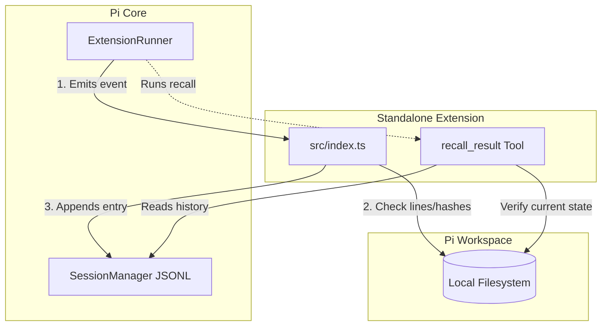
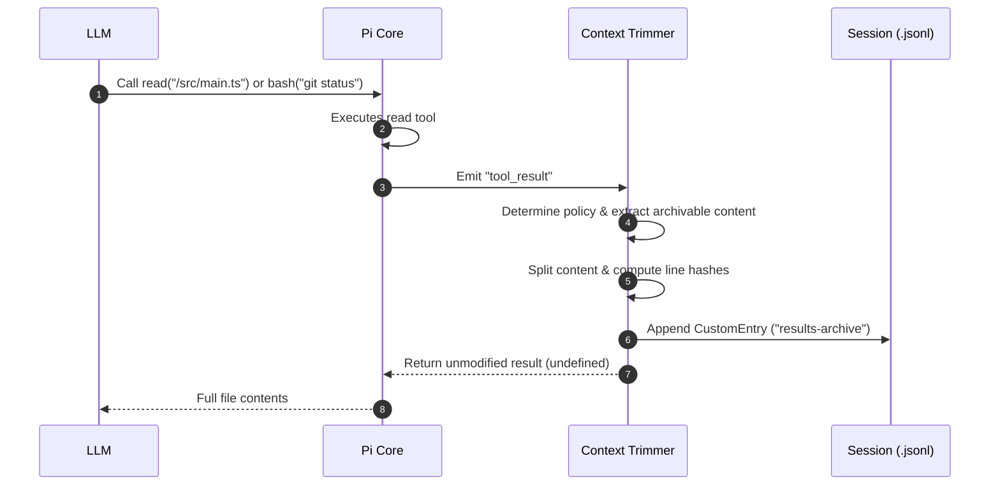
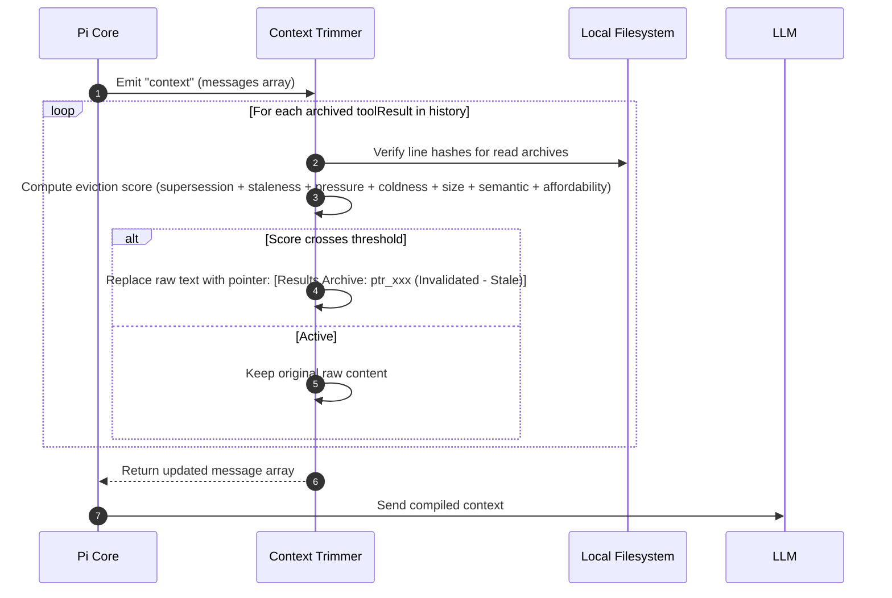
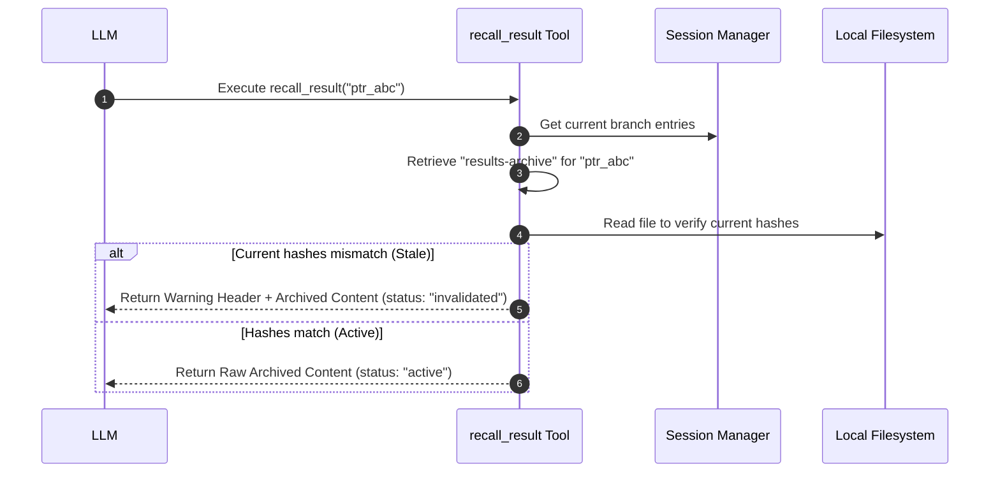

# Pi Context Trimmer: Architecture & Module Interaction

This directory documents the structure, components, and module interactions of the **Pi Context Trimmer** extension.

---

## 1. Project Module Overview

The project is structured as a standalone Bun package with the following layout:

```text
pi-context-trimmer/
├── package.json               # Package configuration & Extension registration
├── tsconfig.json              # TypeScript compilation rules
├── src/
│   ├── index.ts               # Extension entry point (wires handlers & tool)
│   ├── types.ts               # Shared types and policies
│   ├── state.ts               # Archive state management
│   ├── utils.ts               # Hashing, footer stripping, staleness check
│   ├── archive.ts             # tool_result archiving handler
│   ├── context.ts             # context compilation / staleness replacement
│   └── recall.ts              # recall_result tool
├── test/
│   └── context-trimmer.test.ts # Automated unit test suite
└── docs/
    └── architecture.md        # System architecture documentation (This file)
```

### Components

#### 1. Package Configuration (`package.json`)
*   Declares the package metadata, dependencies (`@earendil-works/pi-coding-agent` and `typebox`), and test scripts.
*   Uses the `"pi"` configuration block to register the extension's entry point:
    ```json
    "pi": {
      "extensions": ["./src/index.ts"]
    }
    ```

#### 2. Extension Entry Point (`src/index.ts`)
*   Exposes a default function that receives the `ExtensionAPI`.
*   Initializes shared archive state (`src/state.ts`).
*   Wires event handlers for `"session_start"`, `"session_tree"`, `"tool_result"`, and `"context"`.
*   Registers the custom tool `recall_result`.

#### 3. Supporting Modules
*   `src/types.ts` — Shared interfaces and the per-tool policy registry (`POLICIES`).
*   `src/state.ts` — In-memory archive state and session rebuild logic.
*   `src/utils.ts` — SHA-256 hashing, read-tool footer stripping, and staleness checks (file-based and immutable).
*   `src/archive.ts` — `tool_result` handler that archives supported tool results.
*   `src/context.ts` — `context` handler that replaces superseded, stale, or pressure-evicted results with pointers.
*   `src/recall.ts` — `recall_result` tool for on-demand archived content retrieval.

#### 4. Test Suite (`test/context-trimmer.test.ts`)
*   Uses `bun:test` to spin up a mock `ExtensionRunner` and `SessionManager` in memory.
*   Exercises the extension hooks synchronously to validate pointer replacements, file-based staleness changes, partial-read tolerances, tool-agnostic archiving, and the recall tool execution.

---

## 2. Module Interactions & Lifecycle Flows

The extension acts as a hook middleware that intercepts operations between the **Pi Coding Agent**, the **Active Conversation Session**, the **Local Filesystem**, and the **LLM Context Window**.



### A. Tool Execution Flow (Intercepting & Archiving)

When the Pi agent executes a supported tool:
1.  The Pi Core executes the tool, returning its output.
2.  The extension's `"tool_result"` event handler intercepts the payload.
3.  It looks up the per-tool policy (`POLICIES`) using `event.toolName`.
4.  The policy's `extractContent` function determines what to archive:
    *   For `read`, prefer `details.truncation.content`, otherwise strip the read-tool continuation footer from the raw text.
    *   For other tools, prefer `details.truncation.content` when available, otherwise use the joined text content.
    *   If `details.truncation.firstLineExceedsLimit` is true, nothing is archived.
5.  The policy's `getParameterKey` function builds a stable identifier from the tool input (e.g. file path, command string, search query).
6.  It splits the cleaned content on `"\n"` and computes SHA-256 hashes for each line.
7.  It appends a custom `"results-archive"` entry containing the original tool result content, line hashes, staleness/supersession strategies, and the starting line index to the `.jsonl` log file.
8.  The handler returns `undefined`, allowing the full result to go to the model in full at the current turn.



### B. Context Compilation Flow (Eviction Scoring)

Before sending the conversation history to the LLM for the next turn:
1.  Pi Core triggers context compilation, emitting the `"context"` event with the current `AgentMessage[]` array.
2.  The extension's handler checks all historical archived tool results and computes a normalized **eviction score** in `[0, 1]` for each — a weighted sum where each weight is that signal's *share* of the total (weights sum to 1):
    *   **Supersession**: newer archives of the same tool/parameter group (`line-range` for `read`, `exact-key` for `bash`/`grep`/`find`/`ls`).
    *   **Staleness** (confidence-weighted): a `read` whose file changed on disk is *proven* stale; immutable tools can only be *assumed* stale, so their signal is discounted.
    *   **Pressure**: rises as the compiled context crosses a percent / absolute-token knee; shared by every candidate that turn.
    *   **Coldness** and **Size**: older, larger archives are more disposable.
    *   **Semantic**: per-tool disposability (reads are the most valuable to keep).
    *   **Affordability**: the KV-cache counterweight — content whose removal invalidates a long suffix scores lower. Its **co-location bump** sets affordability to 1 for archives already inside a suffix being invalidated anyway.
3.  **Proven-dead content evicts freely** (full supersession or proven-stale read), independent of pressure. **Still-valid content is capped**: only eligible once there is genuine pressure *and* its score clears the threshold.
4.  **The most recently archived tool result is always protected** so a fresh result is usable verbatim on the turn it is produced.
5.  **Batching**: eligible removals are held until they would free at least `minBatchTokens` (or the overflow guard trips), so eviction is a few large, amortized KV-cache invalidations rather than a trickle. Eviction is **append-only** — a pointer that replaces a result stays.
6.  For each evicted archive the raw text is replaced in-memory with `[Results Archive: pointer_id (Invalidated - Stale)]`.
7.  The modified message array is compiled and sent to the LLM.

> The aggressiveness knobs (threshold, pressure knees, batch size) are set by principle; the signal weights and per-tool semantics are tuned by `benchmark/optimize.ts`. The scoring in `src/eviction.ts` runs identically in production and under test — there is no test-only reparameterization.



### C. Result Recall Flow (On-Demand Retrieve)

If the model sees a stale pointer `[Results Archive: ptr_xxx (Invalidated - Stale)]` and decides it needs to inspect the historical state of the file:
1.  The LLM executes the `recall_result(pointer_id: "ptr_xxx")` tool.
2.  The tool searches the active branch logs in the Session Manager to find the corresponding `"results-archive"` custom entry.
3.  The tool checks the current file on disk:
    *   **If Stale**: Returns the archived content wrapped in `<recalled-stale-content>` XML tags and preceded by a warning that the pointer was invalidated.
    *   **If Active** (e.g. reverted manually by the user): Returns the raw content string.



---

## 3. Data Schema & Core Type Definitions

The interactions between the modules are governed by structured TypeBox schemas and TypeScript interfaces:

```typescript
/**
 * Stored in the session JSONL file as custom entries.
 * Represents a durable, read-only snapshot of the tool result.
 */
export interface ArchivedResult {
  pointerId: string;              // Unique pointer ID (e.g., "ptr_a8f9d3b")
  toolName: string;               // Tool name ("read", "bash", "grep", etc.)
  toolCallId: string;             // ID of the tool execution call
  parameterKey: string;           // Resolved identifier for the tool invocation
  stalenessStrategy?: "file-lines" | "immutable";
  supersessionStrategy?: "line-range" | "exact-key" | "none";
  timestamp: number;              // Date.now() timestamp
  originalContent: string;        // JSON-serialized string of the tool result
  startLine: number;              // 1-indexed starting line range
  lineHashes: string[];           // SHA-256 hashes of each archived line
}

/**
 * Declares matching policies for tools that can be trimmed.
 */
export interface ToolPolicy {
  toolName: string;
  getParameterKey: (input: Record<string, any>) => string | undefined;
  extractContent: (event: ToolResultEvent) => string | undefined;
  stalenessStrategy: "file-lines" | "immutable";
  supersessionStrategy: "line-range" | "exact-key" | "none";
}
```
