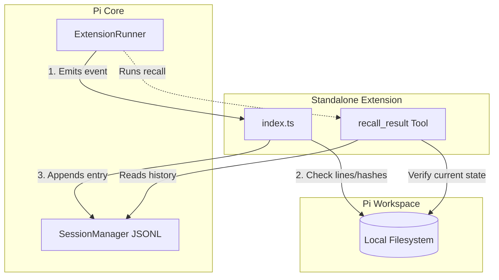
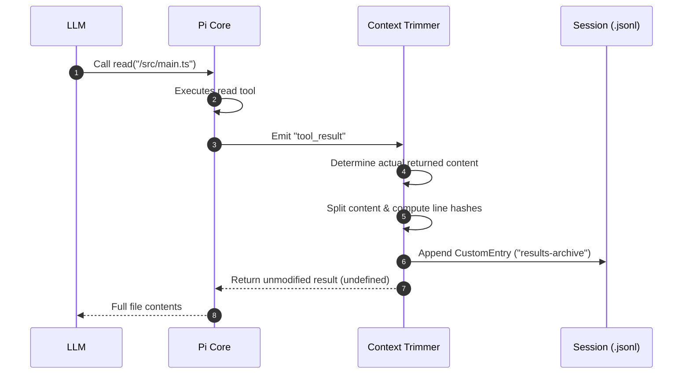
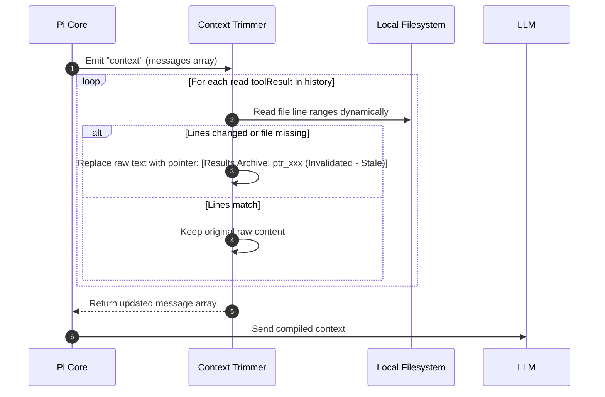
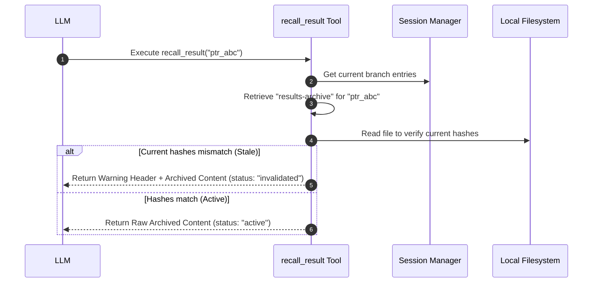

# Pi Context Trimmer: Architecture & Module Interaction

This directory documents the structure, components, and module interactions of the **Pi Context Trimmer** extension.

---

## 1. Project Module Overview

The project is structured as a standalone Bun package with the following layout:

```text
pi-context-trimmer/
├── package.json               # Package configuration & Extension registration
├── tsconfig.json              # TypeScript compilation rules
├── index.ts                   # Core extension logic (Hooks, Policies & Tools)
├── test/
│   └── context-trimmer.test.ts # Automated unit test suite
└── docs/
    └── architecture.md        # System architecture documentation (This file)
```

### Components

#### 1. Package Configuration (`package.json`)
*   Declares the package metadata, dependencies (`@earendil-works/pi-coding-agent` and `typebox`), and test scripts.
*   Uses the `"pi"` configuration block to register the extension's entry point:
    ```json
    "pi": {
      "extensions": ["./index.ts"]
    }
    ```

#### 2. Extension Entry Point (`index.ts`)
*   Exposes a default function that receives the `ExtensionAPI`.
*   Registers event handlers for `"session_start"`, `"session_tree"`, `"tool_result"`, and `"context"`.
*   Implements the line-level hashing and disk-based file validation (`checkStaleness`).
*   Registers the custom tool `recall_result`.

#### 3. Test Suite (`test/context-trimmer.test.ts`)
*   Uses `bun:test` to spin up a mock `ExtensionRunner` and `SessionManager` in memory.
*   Exercises the extension hooks synchronously to validate pointer replacements, file-based staleness changes, partial-read tolerances, and the recall tool execution.

---

## 2. Module Interactions & Lifecycle Flows

The extension acts as a hook middleware that intercepts operations between the **Pi Coding Agent**, the **Active Conversation Session**, the **Local Filesystem**, and the **LLM Context Window**.



### A. Tool Execution Flow (Intercepting & Archiving)

When the Pi agent executes a `read` tool:
1.  The Pi Core executes the tool, returning the contents of the file on disk.
2.  The extension's `"tool_result"` event handler intercepts the payload.
3.  It determines the actual file content returned by the read tool:
    *   Prefer the structured `details.truncation.content` metadata when available.
    *   When `details.truncation` is not set (for example, a user-specified `limit` left more content in the file), strip the read-tool continuation footer from the raw text.
    *   If `details.truncation.firstLineExceedsLimit` is true, no actual file content was returned, so nothing is archived.
4.  It splits the cleaned content on `"\n"` (matching pi's read tool) and computes SHA-256 hashes for each line.
5.  It appends a custom `"results-archive"` entry containing the original tool result content, line hashes, and the starting line index to the `.jsonl` log file.
6.  The handler returns `undefined`, allowing the full file content to go to the model in full at the current turn.



### B. Context Compilation Flow (Dynamic Staleness check)

Before sending the conversation history to the LLM for the next turn:
1.  Pi Core triggers context compilation, emitting the `"context"` event with the current `AgentMessage[]` array.
2.  The extension's handler checks all historical `"read"` tool results.
3.  For each result, it reads the current state of the file on disk and splits it on `"\n"`, matching pi's read tool.
4.  It verifies if the hashes of the specific lines read have changed:
    *   **If unchanged (Active)**: The raw text is left untouched.
    *   **If changed or file deleted (Stale)**: The raw text is replaced in-memory with `[Results Archive: pointer_id (Invalidated - Stale)]`.
5.  The modified message array is compiled and sent to the LLM.



### C. Result Recall Flow (On-Demand Retrieve)

If the model sees a stale pointer `[Results Archive: ptr_xxx (Invalidated - Stale)]` and decides it needs to inspect the historical state of the file:
1.  The LLM executes the `recall_result(pointer_id: "ptr_xxx")` tool.
2.  The tool searches the active branch logs in the Session Manager to find the corresponding `"results-archive"` custom entry.
3.  The tool checks the current file on disk:
    *   **If Stale**: Returns the archived content wrapped in `<recalled-stale-content>` XML tags and preceded by a warning that the pointer was invalidated.
    *   **If Active** (e.g. reverted manually by the user): Returns the raw content string.



---

## 3. Data Schema & Core Type Definitions

The interactions between the modules are governed by structured TypeBox schemas and TypeScript interfaces:

```typescript
/**
 * Stored in the session JSONL file as custom entries.
 * Represents a durable, read-only snapshot of the file's lines at read time.
 */
export interface ArchivedResult {
  pointerId: string;         // Unique pointer ID (e.g., "ptr_a8f9d3b")
  toolName: string;          // Tool name ("read")
  toolCallId: string;        // ID of the tool execution call
  parameterKey: string;      // Absolute or relative path to the read file
  timestamp: number;         // Date.now() timestamp
  originalContent: string;   // JSON-serialized string of the tool result
  startLine: number;         // 1-indexed starting line range
  lineHashes: string[];      // SHA-256 hashes of each read line
}

/**
 * Declares matching policies for tools that can be trimmed.
 */
export interface ToolPolicy {
  toolName: string;
  getParameterKey: (input: Record<string, any>) => string | undefined;
  shouldArchive: (content: string) => boolean;
}
```
